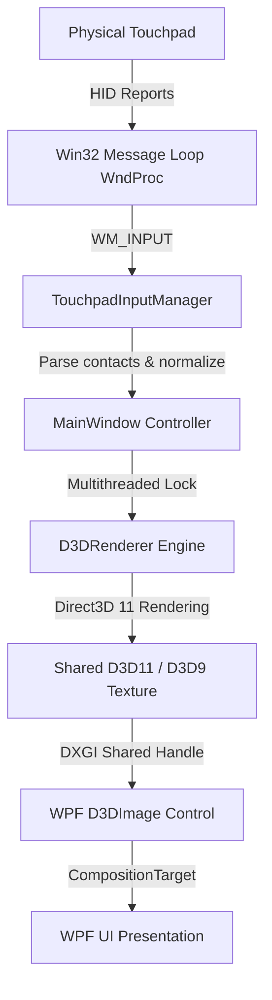

# TouchpadVisualizer 🎨✨

[](#)
[](#)
[](#)
[](#)

TouchpadVisualizer is a high-performance, premium Windows desktop application that captures low-level raw HID inputs from Windows Precision Touchpads (PTP) and renders them in real-time with stunning GPU-accelerated visuals. 

Built using .NET 9.0, WPF, and Direct3D 11 (via Vortice.Windows), it serves as both an interactive desktop toy and a test-bed for low-level input interop and custom graphics pipelines.

---

## 🚀 Key Features

*   **Raw Precision Touchpad Integration**: Bypasses Windows standard cursor emulation to read raw multi-touch data (up to 5 fingers), raw coordinate tracking, contacts, and physical contact pressure.
*   **Direct3D 11 Graphics Pipeline**: High-performance particle physics, fluid ripple propagation, and motion trails running on a dedicated render thread.
*   **HLSL Shader Suite**: Post-processing effects including high-pass bloom thresholding, multi-pass gaussian blur, radial ripples, and customizable neon backgrounds.
*   **Built-in Piano Tiles Arcade Game**: A fully playable, music-synced rhythm game mapping physical touchpad zones (or keyboard keys `D`, `F`, `J`, `K`) to lanes, featuring a native MIDI synth engine.
*   **WPF-D3D Interop**: Ultra-smooth rendering using shared DXGI/D3D9/D3D11 textures hosted directly inside the WPF window via `D3DImage`.
*   **Comprehensive Customization**: Control frame rate limits, particle density, 3D perspective angle, neon glow intensity, and background gradient profiles in real-time.
*   **Hardware Calibration**: Calibrate physical touchpad boundaries to map your hardware boundaries perfectly to the visualization viewport.

---

## 🛠️ Architecture & How It Works

TouchpadVisualizer bridges the gap between Windows' Win32 raw input event loops and low-level GPU rendering frameworks.



### 1. The Input Subsystem ([TouchpadInputManager](file:///e:/touch/src/TouchpadVisualizer/Input/TouchpadInputManager.cs))
- Registers as a Raw Input sink (`RegisterRawInputDevices`) for the Digitizer/Touchpad HID usage page (`UsagePage = 0x0D`, `Usage = 0x05`).
- Captures `WM_INPUT` messages and parses raw HID reports.
- Handles both **Parallel** reporting (all finger contacts sent in a single packet) and **Serial/Hybrid** reporting (each contact sent in sequence, buffered, and flushed on packet completion).
- Explicitly blocks and handles native Windows gesture messages (`WM_GESTURE`, `WM_GESTURENOTIFY`, `WM_TOUCH`, and `WM_POINTER*` events) to suppress Windows system gestures (like swipe-to-desktop) from interrupting the application.

### 2. The Graphics Subsystem ([D3DRenderer](file:///e:/touch/src/TouchpadVisualizer/Rendering/D3DRenderer.cs))
- Direct3D 11 context initialized using **Vortice.Windows** bindings.
- Particle system, trail physics, and water ripples updated on a separate high-priority rendering thread.
- Composed of custom HLSL shaders compiled dynamically or at runtime:
  - [Background.hlsl](file:///e:/touch/src/TouchpadVisualizer/Shaders/Background.hlsl): Animated gradient backgrounds.
  - [Ripple.hlsl](file:///e:/touch/src/TouchpadVisualizer/Shaders/Ripple.hlsl): Renders contact-initiated shockwaves.
  - [Trail.hlsl](file:///e:/touch/src/TouchpadVisualizer/Shaders/Trail.hlsl): Draws smooth paths behind moving fingers.
  - [Particle.hlsl](file:///e:/touch/src/TouchpadVisualizer/Shaders/Particle.hlsl): Renders custom instances of floating/bursting particles.
  - [Bloom.hlsl](file:///e:/touch/src/TouchpadVisualizer/Shaders/Bloom.hlsl) & [Composite.hlsl](file:///e:/touch/src/TouchpadVisualizer/Shaders/Composite.hlsl): Extracts bright highlights and performs dual-pass blurring for premium neon glow aesthetics.

---

## 🎮 Keyboard & Input Controls

| Key | Action |
|---|---|
| `Escape` | Close Application / Quit Game to Menu |
| `S` | Toggle Settings Customization Panel |
| `F11` | Toggle Fullscreen / Windowed Mode |
| `G` | Launch Built-in **Piano Tiles** Game |
| `H` | Toggle HUD Overlays (FPS / Touch Count / Gesture type) |
| `P` | Pause / Resume Game (when playing Piano Tiles) |
| `D`, `F`, `J`, `K` | Left-to-Right lane keys (Piano Tiles keyboard fallback) |

---

## 🎹 Piano Tiles Game

Launch the game by pressing `G` in the main visualizer.

*   **Zone Mapping**: The touchpad width is divided into 4 virtual columns. Tapping any area maps directly to Lane 1, 2, 3, or 4.
*   **Audio Engine**: Features a dedicated [MidiPlayer](file:///e:/touch/src/TouchpadVisualizer/Game/MidiPlayer.cs) that talks to the native Windows MIDI Synthesizer (`msmusrv.dll`/`winmm.dll`) to play corresponding instrument notes on hits.
*   **Visuals**: Deep neon lighting, gravity-effect particle bursts on hits, combo streaks, and song completion scores.

---

## ⚙️ Building & Running

### Prerequisites
*   **OS**: Windows 10 or Windows 11 (with a Precision Touchpad).
*   **SDK**: [.NET 9.0 SDK](https://dotnet.microsoft.com/download/dotnet/9.0)
*   **IDE**: Visual Studio 2022, JetBrains Rider, or VS Code.

### Compilation
Open a terminal in the root directory and run:

```bash
# Restore dependencies and build
dotnet build TouchpadVisualizer.sln -c Release

# Run the project
dotnet run --project src/TouchpadVisualizer/TouchpadVisualizer.csproj
```

### Calibration Guide
If you launch the app and touches don't align with your physical fingers, calibrate the touchpad bounds:
1. Open Settings (`S`) and click **Start Calibration** (or follow the first-run prompt).
2. Slide your finger to all four corners of your touchpad.
3. Click **Complete Calibration** to lock in your custom physical bounds. This registers the min/max coordinates and saves them to AppData (`%APPDATA%/TouchpadVisualizer/settings.json`).

---

## 📂 Repository Structure

```
├── TouchpadVisualizer.sln        # Visual Studio Solution
├── src/                          # Source Code
│   └── TouchpadVisualizer/
│       ├── Input/                # Raw Input & HID parsing (Precision Touchpad)
│       ├── Rendering/            # D3D11 Engine, Particle, Ripple & Trail processors
│       ├── Shaders/              # Custom HLSL shader code (compiled at runtime)
│       ├── Models/               # Contact data structures, settings, configuration
│       ├── ViewModels/           # WPF MVVM ViewModels
│       └── Views/                # WPF Windows (MainWindow, PianoTilesWindow)
├── docs/                         # Additional Documentation
│   └── GIT_GUIDE.md              # Git branch & workflow instructions
└── test/                         # Reflection check utilities & unit checks
```
